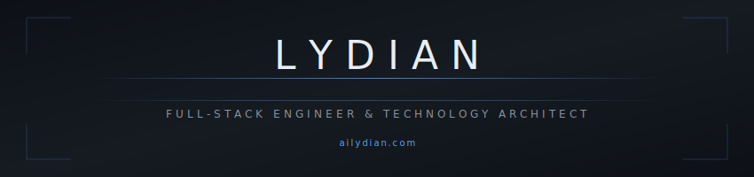

  

 

  
  &nbsp;
  
  &nbsp;
  

 

---

## About

Technology architect and full-stack engineer building enterprise-grade platforms across healthcare, fintech, legal tech, agriculture, gaming, and government sectors.

Creator of the **AiLydian** ecosystem — a suite of 15+ specialized platforms leveraging modern web technologies, real-time systems, and blockchain infrastructure. Each platform is built to production standards: type-safe, performant, and architected for scale.

---

## Technology Ecosystem

<table>
<tr>
<td width="34%" valign="top">

### Healthcare

**[Median Health](https://github.com/lydianai/median.ailydian.com)**
Blockchain-powered health records platform with TEE privacy architecture and FDA-compliant analytics pipeline.

**[VitalCare](https://github.com/lydianai/medi.ailydian.com)**
Hospital SaaS with 17 integrated management modules covering clinical, administrative, and financial workflows.

**[HealthAgent](https://github.com/lydianai/agent.ailydian.com)**
Multi-agent hospital management system with quantum-inspired scheduling optimization.

**[GHYS](https://github.com/lydianai/gelismis-hastane-yonetim-sistemi)**
Enterprise hospital management built on microservices architecture with full FHIR R5 compliance.

**[LifeBridge](https://github.com/lydianai/kan-bagis-platformu)**
Blood donation logistics platform with intelligent donor-recipient matching algorithms.

**[MedBoard](https://github.com/lydianai/medical.ailydian.com)**
Healthcare analytics dashboard with real-time clinical data visualization.

</td>
<td width="33%" valign="top">

### FinTech & Legal

**[LyTrade Scanner](https://github.com/lydianai/borsa.ailydian.com)**
Cryptocurrency trading signals platform with 13+ technical strategies, real-time market analysis across 617 trading pairs, and backtesting infrastructure.

**[Payream](https://github.com/lydianai/Payream)**
Payment processing platform with multi-gateway integration, reconciliation engine, and PCI-DSS compliant architecture.

**[HukukAI](https://github.com/lydianai/atty.ailydian.com)**
Legal intelligence platform aggregating multi-jurisdiction court data with vector search and NLP-powered case analysis.

### Government & Architecture

**[ADE](https://github.com/lydianai/ade.ailydian.com)**
Smart government digital services ecosystem with integrations across 18 ministry data systems.

**[MimarAI](https://github.com/lydianai/mimar.ailydian.com)**
Architectural design intelligence platform with 3D rendering, parametric modeling, and CAD export.

</td>
<td width="33%" valign="top">

### Innovation & Consumer

**[Anadolu Realm](https://github.com/lydianai/anatolia.ailydian.com)**
Turkish digital metropolis MMO built on PixiJS engine with WebSocket-powered multiplayer infrastructure.

**[NemesisAI](https://github.com/lydianai/oyun.ailydian.com)**
Adaptive competitive gaming platform featuring an evolving rival system that learns and responds to player patterns.

**[AgriTech Pro](https://github.com/lydianai/tarim.ailydian.com)**
Agricultural intelligence platform integrating 18+ live data sources including satellite imagery, soil sensors, and weather APIs.

**[TurkOto](https://github.com/lydianai/otoail.ailydian.com)**
Vehicle management assistant with OBD-II live telemetry, predictive maintenance, and voice control.

**[LyDian Voice](https://github.com/lydianai/voice.ailydian.com)**
Turkish-language voice assistant deployed as an offline-capable PWA.

**[Travel LyDian](https://github.com/lydianai/holiday.ailydian.com)**
Enterprise tourism platform with 3D destination visualization and integrated booking APIs.

</td>
</tr>
</table>

---

## Core Stack

  
  
  
  
  
  
  
  

  
  
  
  
  
  
  
  

  
  
  
  
  
  
  
  

---

## Domains of Expertise

| Domain | Platforms | Key Technologies |
|:-------|:---------:|:----------------|
| Healthcare | 6 | FHIR R5, HIPAA compliance, Blockchain TEE, Multi-agent orchestration |
| FinTech | 2 | Real-time trading signals, Payment gateway integration, Technical analysis |
| Legal Tech | 1 | Court data aggregation, Vector search, NLP case analysis |
| AgriTech | 1 | Satellite imagery, IoT sensor integration, 18+ live data sources |
| Gaming | 2 | PixiJS engine, WebSocket multiplayer, Adaptive AI systems |
| Tourism | 1 | 3D visualization, Booking API integration, Multi-language support |
| Automotive | 1 | OBD-II telemetry, Predictive maintenance, Voice control |
| Government | 1 | 18 ministry integrations, Digital citizen services |
| Architecture | 1 | 3D parametric modeling, CAD export, Collaborative design |

---

## Architecture Principles

All platforms in this ecosystem are built to the same engineering standard:

- **Type safety throughout** — TypeScript on the frontend, strict schemas on the backend, shared contract types across service boundaries
- **Real-time by default** — WebSocket infrastructure built in from the start, not retrofitted
- **Security-first** — OWASP Top 10 compliance, parameterized queries exclusively, secrets in environment variables, HTTPS/TLS enforced
- **Scalable infrastructure** — Docker containerization, Kubernetes orchestration, horizontal scaling paths defined at design time
- **Observability** — Structured logging, metrics endpoints, distributed tracing across service calls

---

  
  &nbsp;
  
  &nbsp;
  
  &nbsp;
  

 

  All repositories are proprietary unless explicitly licensed otherwise.

