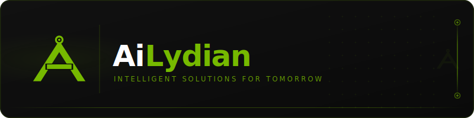

  

   

  **Enterprise SaaS Platform Ecosystem** | **Kurumsal SaaS Platform Ekosistemi**

  
  
  

---

### About

AiLydian builds production-grade intelligent platforms that serve enterprise clients across 8+ industry verticals. Our technology stack combines proprietary analysis engines, real-time data processing, and scalable cloud architecture to deliver measurable business outcomes.

**18+ production platforms** | **8 industry verticals** | **Proprietary technology** | **Enterprise security**

---

### Platform Portfolio

<table>
<tr><td colspan="3"><strong>HealthTech & Medical</strong></td></tr>
<tr>
<td><a href="https://github.com/lydianai/median.ailydian.com"><b>Median Health</b></a> Blockchain-powered health platform with TEE privacy</td>
<td><a href="https://github.com/lydianai/agent.ailydian.com"><b>HealthAgent</b></a> Multi-agent healthcare with hospital management</td>
<td><a href="https://github.com/lydianai/medi.ailydian.com"><b>VitalCare</b></a> Global healthcare SaaS with 17 modules</td>
</tr>
<tr>
<td><a href="https://github.com/lydianai/medical.ailydian.com"><b>MedBoard</b></a> Healthcare analytics dashboard</td>
<td><a href="https://github.com/lydianai/gelismis-hastane-yonetim-sistemi"><b>GHYS</b></a> Enterprise hospital management system</td>
<td><a href="https://github.com/lydianai/kan-bagis-platformu"><b>LifeBridge</b></a> Blood donation with intelligent matching</td>
</tr>
<tr><td colspan="3"><strong>FinTech & Payments</strong></td></tr>
<tr>
<td><a href="https://github.com/lydianai/borsa.ailydian.com"><b>LyTrade Scanner</b></a> Crypto trading signals, 617 market analysis</td>
<td><a href="https://github.com/lydianai/Payream"><b>Payream</b></a> Payment processing, 18 bank integrations</td>
<td></td>
</tr>
<tr><td colspan="3"><strong>GovTech & Legal</strong></td></tr>
<tr>
<td><a href="https://github.com/lydianai/ade.ailydian.com"><b>ADE</b></a> Smart government, 18 ministry APIs</td>
<td><a href="https://github.com/lydianai/atty.ailydian.com"><b>HukukAI</b></a> Legal intelligence, court data integration</td>
<td></td>
</tr>
<tr><td colspan="3"><strong>TravelTech & Automotive & AgriTech</strong></td></tr>
<tr>
<td><a href="https://github.com/lydianai/holiday.ailydian.com"><b>Travel LyDian</b></a> Global tourism with 3D experiences</td>
<td><a href="https://github.com/lydianai/otoail.ailydian.com"><b>OtoAI</b></a> Vehicle assistant, OBD-II diagnostics</td>
<td><a href="https://github.com/lydianai/tarim.ailydian.com"><b>AgriTech Pro</b></a> Precision agriculture, 18+ data sources</td>
</tr>
<tr><td colspan="3"><strong>Design & Voice & Gaming</strong></td></tr>
<tr>
<td><a href="https://github.com/lydianai/mimar.ailydian.com"><b>MimarAI</b></a> Architectural design with 3D visualization</td>
<td><a href="https://github.com/lydianai/voice.ailydian.com"><b>LyDian Voice</b></a> Voice assistant PWA, wake-word detection</td>
<td><a href="https://github.com/lydianai/anatolia.ailydian.com"><b>Anadolu Realm</b></a> MMO with real-time economy</td>
</tr>
<tr>
<td><a href="https://github.com/lydianai/oyun.ailydian.com"><b>NemesisAI</b></a> Adaptive competitive gaming</td>
<td><a href="https://github.com/lydianai/www.ailydian.com"><b>AiLydian.com</b></a> Corporate technology portal</td>
<td></td>
</tr>
</table>

---

### Technology

### Security & Compliance

---

**info@ailydian.com** · **ailydian@ailydian.com** · **[ailydian.com](https://ailydian.com)**

*All repositories are proprietary. See individual LICENSE files for terms.*

Copyright &copy; 2025-2026 AiLydian. All Rights Reserved.

